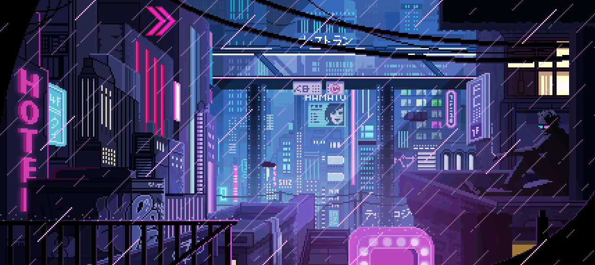

# Hi, I'm Lucas — Full Stack Web Developer

I'm a developer and founder focused on creating scalable, robust, and sustainable web systems, transforming ideas into products that deliver measurable business value.  
At Kyberno TechHouse, I lead projects in software architecture, SaaS development, and automation, combining clean code with strategic design.

Technologies I work with  
`React` · `Next.js` · `Django` · `PostgreSQL` · `Docker` · `TailwindCSS`

---

## About Kyberno TechHouse

At Kyberno TechHouse, we build custom software solutions that align technology with business goals.  
Our focus is on clarity, performance, and reliability — delivering modern systems that scale efficiently.

Website: https://www.kyberno.com.br/  
LinkedIn: https://www.linkedin.com/company/kyberno-techhouse/

---

## Featured Projects

### KyVoice – Real-Time P2P Communication Platform

Enterprise-grade real-time communication platform built for encrypted, secure peer-to-peer audio and video calls. Features multi-user voice rooms, screen sharing, and real-time messaging with direct connections, low latency, and a strong focus on privacy.

`Django` · `JavaScript` · `WebRTC`

Website: https://www.kyvoice.com.br/  
GitHub: https://github.com/codewithsouza/DISCORDO-demo

---

### SEPA – Creative Expression Platform

A vibrant and expressive platform designed to empower individuals to share ideas, music, and inspiration with the world. SEPA offers a modern space where creativity meets community — connecting artists, thinkers, and dreamers through authentic expression.

`React` · `Node.js` · `TypeScript`

---

### UAI Contabilidade – Professional Landing Page

Modern and responsive landing page designed to highlight accounting services, with a focus on clarity, credibility, and lead conversion. Clean and strategic interface built to attract new clients and present services effectively.

`Next.js` · `React` · `TypeScript`

Website: https://www.uaicontabilidade.com.br/

---

### CRM – Customer Relationship Management

System to centralize leads, contacts, and sales pipeline. Organizes opportunities, activities, and history in a single dashboard so business teams can make clear, data-driven decisions.

`Next.js` · `TypeScript` · `TailwindCSS`

---

### Fredplugz – Beatmaker E-commerce

Platform for distribution and sale of beats and drum kits for artists. Exclusive catalog with instant preview, direct purchase via WhatsApp integration, and immediate delivery.

`Next.js` · `E-commerce` · `WhatsApp API`

Website: https://fredplugz.com/

---

### Fecit – Streetwear E-commerce

Streetwear fashion online store with a bold visual identity. T-shirt and accessories catalog with urban aesthetics, shopping system, and digital storefront.

`E-commerce` · `Online Store` · `Streetwear`

---

### Artist Hub – Centralized Artist Management

Hub to centralize schedule, shows, albums, and contractor contacts. Organizes calendar, materials, and key details in one dashboard for fast, professional decisions.

`Next.js` · `TypeScript` · `TailwindCSS`

---

### Hub LX – Complete Artist Ecosystem

Platform to centralize releases, contractors, media kit, and everything the artist needs in one organized place, with a clear and structured overview.

`Next.js` · `TypeScript` · `TailwindCSS`

---

## Languages & Tools

  
  
  
  
  
  
  
  
  
  

---

## Contact Me

Email: lds.antunesdev@gmail.com  
Upwork: https://www.upwork.com/freelancers/~01528998e13ceaa5aa  
LinkedIn: https://www.linkedin.com/in/lucas-souza-a869882aa/

---

Let's build something great together. Available for freelance and remote work.
